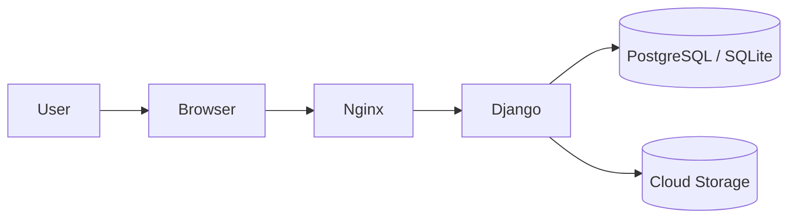

# recipe_post

recipe_post は、料理レシピを投稿・閲覧・管理できる Django アプリです。  
レシピの登録、一覧表示、編集、削除を簡単に行えます。

## 概要

レシピを保存して管理するための Web アプリです。  
Django を使い、レシピの投稿と表示を簡単に実装できます。

主な機能:
- レシピの新規作成
- レシピ一覧表示
- 詳細表示
- 編集・削除
- 画像やメモの管理
- 管理画面での運用

## 技術スタック

- Python
- Django
- SQLite / PostgreSQL
- HTML / CSS / JavaScript

## インフラ構成



## 必要条件

- Python 3.10 以上
- pip
- virtualenv
- PostgreSQL または SQLite
- Git

## セットアップ手順

1. リポジトリを取得する

```bash
git clone <repository-url>
cd recipe_post
```

2. 仮想環境を作成する

```bash
python3 -m venv .venv
source .venv/bin/activate
```

Windows の場合:

```bash
python -m venv .venv
.venv\Scripts\activate
```

3. 依存パッケージをインストールする

```bash
pip install -r requirements.txt
```

もし `requirements.txt` が存在しない場合は、Django を直接インストールします。

```bash
pip install django
```

必要に応じて、DB ドライバや本番用ライブラリも追加してください。

```bash
pip install psycopg2-binary
```

4. 環境変数を設定する

`.env` または環境変数に以下を設定してください。

```bash
SECRET_KEY=your_secret_key
DEBUG=True
ALLOWED_HOSTS=localhost,127.0.0.1
DATABASE_URL=sqlite:///db.sqlite3
```

本番環境では、DB 接続情報やシークレットを Git に含めず、外部の環境変数で管理するのが安全です。

5. データベースを作成する

```bash
python manage.py migrate
```

6. 管理ユーザーを作成する

```bash
python manage.py createsuperuser
```

7. 開発サーバーを起動する

```bash
python manage.py runserver
```

ブラウザで次の URL を開いてください。

```text
http://localhost:8000
```

## 使い方

### レシピを投稿する
1. 管理画面またはフォームから新規レシピを作成します
2. タイトル、材料、手順、画像などを入力します
3. 保存して投稿します

### レシピを閲覧する
- 投稿されたレシピ一覧を確認します
- 各レシピの詳細ページを開きます
- 材料や作り方を確認します

### レシピを編集する
1. 編集したいレシピを選択します
2. 内容を修正します
3. 保存して更新します

### レシピを削除する
1. 削除したいレシピを選択します
2. 削除操作を実行します
3. 確認後に削除します

## Django 管理画面

Django の管理画面を使うと、レシピデータを簡単に確認・編集できます。  
管理画面は次の URL で開けます。

```text
http://localhost:8000/admin/
```

作成したスーパーユーザーでログインしてください。

## 利用可能なコマンド

```bash
python manage.py runserver
python manage.py migrate
python manage.py makemigrations
python manage.py createsuperuser
python manage.py shell
python manage.py test
```

## プロジェクト構成

```text
recipe_post/
├── config/
│   ├── __init__.py
│   ├── settings.py
│   ├── urls.py
│   └── wsgi.py
├── app/
│   ├── migrations/
│   ├── templates/
│   ├── static/
│   ├── admin.py
│   ├── apps.py
│   ├── forms.py
│   ├── models.py
│   ├── tests.py
│   ├── urls.py
│   └── views.py
├── manage.py
├── requirements.txt
├── .env.example
├── .gitignore
├── README.md
└── db.sqlite3
```

- `config/`: Django の設定ファイル
- `app/`: アプリケーション本体
- `manage.py`: Django の実行用スクリプト
- `requirements.txt`: 依存関係
- `db.sqlite3`: 開発用 DB（必要に応じて）

## 本番環境への展開

- Web サーバー: Nginx / Cloud Run / App Service 等
- Application: Django
- Database: PostgreSQL
- File Storage: S3 / Cloud Storage / Blob Storage
- Secret Management: .env / Secrets Manager / Vault

この構成により、データの永続化と運用の安定性を高めることができます。

## まとめ

recipe_post は、Django を使ったレシピ投稿アプリです。  
ローカル開発からクラウド運用までを想定しており、シンプルな構成でレシピの管理や共有を行いやすい設計になっています。
